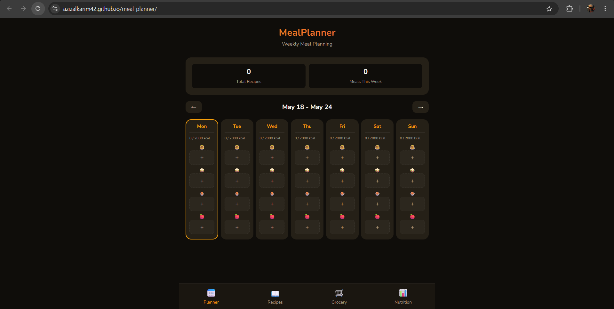
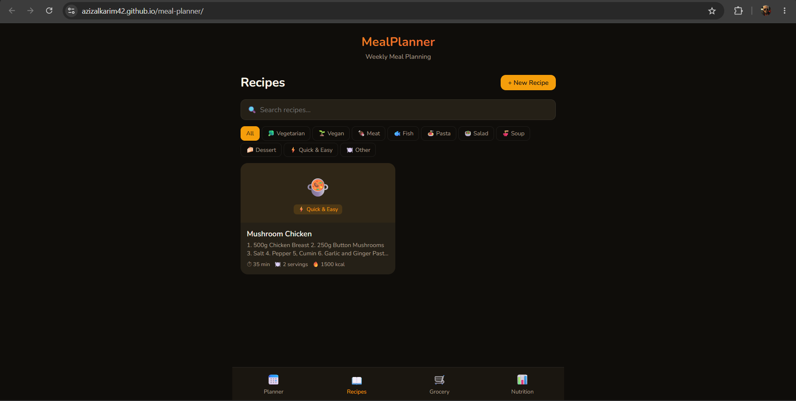
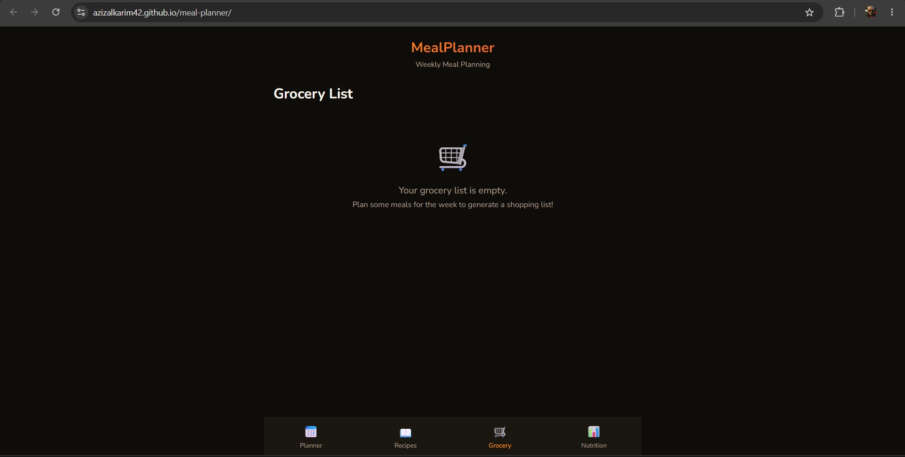

# MealPlanner — Weekly Meal Planning

A client-side web application for planning weekly meals, managing recipes, generating grocery lists, and tracking nutrition. Built entirely in **F#** using [Fable](https://fable.io/) (F# → JavaScript compiler) and [Feliz](https://github.com/Zaid-Ajaj/Feliz) (React bindings).

## Try it Live

👉 **[https://azizalkarim42.github.io/meal-planner/](https://azizalkarim42.github.io/meal-planner/)**

## Screenshots





## Motivation

Meal planning is one of the most effective strategies for eating healthier and saving money, but manually organizing recipes, creating shopping lists, and tracking nutrition across a whole week is tedious. MealPlanner automates this by letting you build a recipe library, drag meals onto a weekly calendar, and automatically generating an aggregated grocery list — all in the browser with no account required.

## Features

- **Weekly Planner** — 7-day grid with breakfast/lunch/dinner/snack slots. Navigate between weeks. Visual daily calorie bars with target indicators.
- **Recipe Library** — Create, edit, and browse recipes with category filtering (Vegetarian, Meat, Pasta, etc.) and search. Favorite recipes for quick access.
- **Rich Recipe Editor** — Add ingredients with quantities and measurement units, step-by-step instructions, nutrition info, prep/cook times, emoji icons, and meal-type suitability.
- **Smart Grocery List** — Automatically aggregated from planned meals. Ingredients grouped by grocery category (Produce, Dairy, Pantry, etc.). Check off items while shopping. Copy to clipboard for sharing.
- **Nutrition Tracking** — Daily calorie/protein/carbs/fat targets with circular progress rings. Weekly calorie chart. Macro distribution breakdown.
- **10 Food Categories** — Vegetarian, Vegan, Meat, Fish, Pasta, Salad, Soup, Dessert, Quick & Easy, Other.
- **9 Measurement Units** — g, kg, ml, L, tbsp, tsp, cup, pc, slice.
- **Persistent Storage** — All data in `localStorage`. No backend needed.
- **Responsive Design** — Mobile-first warm dark theme with orange/amber palette.

## Tech Stack

| Layer | Technology |
|-------|------------|
| Language | F# 8.0 |
| Compiler | Fable 4.x (F# → JavaScript) |
| UI Library | Feliz 2.x (React bindings) |
| Serialization | Thoth.Json |
| Bundler | Vite |
| Hosting | GitHub Pages |

## Architecture

The app follows the **Elm Architecture** (Model-View-Update) with 10 modules:

- **`Types.fs`** — Domain types (Recipe, Ingredient, PlannedMeal, WeekPlan, Nutrition, MealType, FoodCategory)
- **`Storage.fs`** — localStorage persistence with Thoth.Json encoders/decoders
- **`NutritionCalc.fs`** — Nutrition aggregation, target percentage, macro distribution calculations
- **`RecipeEditor.fs`** — Recipe form with ingredient builder, instruction editor, emoji/category pickers
- **`RecipeLibrary.fs`** — Recipe grid with filtering, search, and detail view
- **`WeekPlanner.fs`** — Weekly calendar grid with meal slots, recipe picker modal, daily nutrition bars
- **`GroceryList.fs`** — Aggregated grocery list from meal plan, grouped by category, with clipboard export
- **`Stats.fs`** — Nutrition dashboard with progress rings, weekly calorie chart, macro bars, target settings
- **`App.fs`** — Root init/update/view and navigation
- **`Main.fs`** — React entry point

## Prerequisites

- [.NET 8 SDK](https://dotnet.microsoft.com/download/dotnet/8.0)
- [Node.js 18+](https://nodejs.org/)

## Build & Run

```bash
git clone https://github.com/azizalkarim42/meal-planner.git
cd meal-planner
dotnet tool restore
dotnet restore src
npm install
npm start
```

The app opens at `http://localhost:5173`.

## Production Build

```bash
npm run build
```

Output in `dist/`.

## License

MIT
